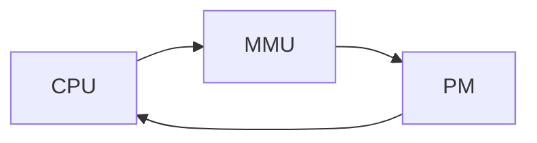

#### 虚拟内存

##### 为了方便管理实际的物理内存

***名词术语***

* 虚拟内存中使用Virtual Page  作为最小单位 P = 2^p, linux 中是4KB
* VA (VPN + VPO)
* PA(PPN + PPO)
* PPO = VPO  依据cacheline 大小决定 64字节 即为 6
* VPO = s + b (s, b 来存储中的 S 集合 和 B Caheline 大小)
* PTE 存储 VPN - PPN  （有效位，权限位）现在有4级PTE

* TBL PTE 的缓存

  

虚拟内存引用的对象分 私有和共享

进程对共享对象的修改 使用 copy on write 机制

内存的分配和回收（显示回收 free()，隐式回收 Gabage Collector）

内存分配需要考虑对齐

闲置的内存用链表标记链接，（优化为Tree 结构）方便找出空闲的内存块


```sequence
CPU-->PM: PA(Phasical Address)
Note right of PM: find address -> get Data
PM-->CPU: Data
```

* 增加虚拟内存

```sequence
CPU --> MMU: VA
MMU--> PM: PA
Note right of PM: find address -> get Data
PM-->CPU: Data
```




```flow
st=>start: CPU
mmu=>operation: MMU
pm=>operation: PM
st(right)->mmu(right)->pm(right)->st
```


