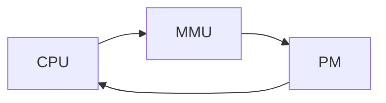

#### 虚拟内存

##### 为了方便管理实际的物理内存

$2^p$

$2^p$

$a^b$


$$
+\infty
$$


***名词术语***

* 虚拟内存中使用Virtual Page 作为最小单位 P = 2^p
* 直接版

```sequence
CPU-->PM: PA(Phasical Address)
Note right of PM: find address -> get Data
PM-->CPU: Data
```

* 增加虚拟内存

```sequence
CPU --> MMU: VA
MMU--> PM: PA
Note right of PM: find address -> get Data
PM-->CPU: Data
```




```flow
st=>start: CPU
mmu=>operation: MMU
pm=>operation: PM
st(right)->mmu(right)->pm(right)->st
```


